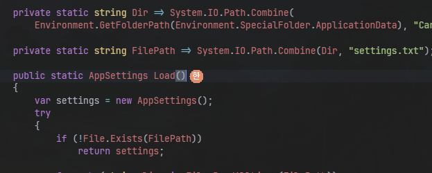
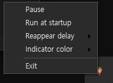

# CarrotIME 🥕

**한국어** | [English](docs/en/README.md)

윈도우 IME 표시기 — 입력 캐럿 우측에 현재 입력기(한 / A)를 표시합니다.



## 소개

macOS의 입력 소스 표시기를 윈도우에서 재현합니다. 지금 입력기가 한글인지 영문인지(일본어·중국어 등 기타 IME도)를 텍스트 캐럿 바로 옆 작은 원으로 알려줍니다.

## 기능

- 캐럿 옆에 현재 입력 상태 표시 (한 / A / あ / 中).
- 편집 가능한 입력란에서만 표시 — 브라우저 본문 같은 읽기 전용 텍스트에는 뜨지 않음.
- 입력 중에는 숨기고, 유휴하면 다시 표시 — 항상(0초)~30초 프리셋 또는 메뉴에서 바로 직접 입력(최대 599초). 기본 20초.
- 인디케이터 배경색·글자색 — 파스텔 팔레트 + 컬러 피커로 자유 지정.
- 인디케이터 투명도 — 메뉴 슬라이더로 20~100% 조절 (기본 75%).
- 트레이 아이콘에도 현재 상태 표시 (가 / A).
- 트레이 메뉴: 일시정지, 표시 지연 시간, 배경색, 글자색, 투명도, Windows 시작 시 실행, About, 종료.
- 윈도우 다크 테마면 메뉴도 다크로 표시.

트레이 컨텍스트 메뉴:



## 빌드

```
dotnet publish src/CarrotIME/CarrotIME.csproj -p:PublishProfile=win-x64
```

→ `src/CarrotIME/bin/publish/CarrotIME-1.0.0.N.exe` — self-contained 단일 실행 파일. .NET 런타임 미설치 PC에서도 실행되며, 실행 시 관리자 권한(UAC) 승인이 필요합니다.

## macOS 버전

`macos` 브랜치에 **Swift/AppKit 네이티브** macOS 앱이 있습니다(`macos/` 디렉터리). 윈도우판과 같은 설계(함수형 코어 / 명령형 셸)를 따르되, OS 접근부는 전부 macOS API로 재작성했습니다.

- 캐럿 옆에 현재 입력 상태 표시 (한 / A / あ / 中), 편집 필드에서만.
- 입력 중엔 숨기고 유휴하면 표시 (1·2·3·5초 프리셋).
- 배경색·글자색(색 견본 메뉴)·투명도(20~100%)·일시정지·로그인 시 시작.
- 메뉴바에 **당근 위에 상태 글자를 겹친 아이콘**.
- 브라우저 캐럿: Safari는 정밀 캐럿, Chrome/Electron은 접근성 활성화 + 필드 프레임 폴백.

상태 판별은 윈도우의 키보드 레이아웃+조합모드 폴링과 달리, **현재 입력 소스 ID** 하나로 갈리고 전환은 이벤트로 처리됩니다.

```
cd macos
./build-app.sh && cp -R build/CarrotIME.app /Applications/
open /Applications/CarrotIME.app
# 시스템 설정 → 개인정보 보호 및 보안 → 손쉬운 사용에서 CarrotIME 허용
```

빌드·설치·접근성 권한·한계(배포용 서명 미구현, 입력 소스 전환 HUD 억제는 OS 제약으로 불가)는 [`macos/README.md`](macos/README.md) 참고.
